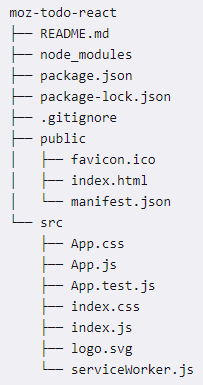
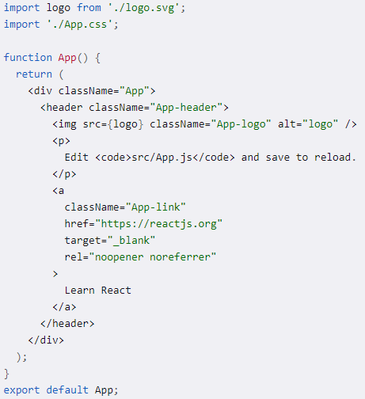

## React 기본 지식

### directory 구조

+ src 디렉토리는 애플리케이션 소스 코드가 있는곳
+ public 브라우저가 읽을 파일들이 있는 곳
    + public 폴더 안에 있는 index.html이 있는 곳으로 React가 코드를 index.html에 주입함으로써 브라우저가 코드를 사용할 수 있게 함.
    
### src/App.js

+ function App()
    + React 컴포넌트는 파스칼-케이스 변수 이름을 사용함
+ Export 문
    + App.js 파일의 최하단의 export default App 라는 명령문은 App 컴포넌트들을 다른 모듈에서 사용가능하게 함
    
### src/index.js

+ ReactDOM.render 내부의 <App />가 보이는데 App.js에서 export default App을 했기 때문에 index.js에서 사용이 가능한 부분

+ ReactDOM.render() 함수는 렌더링하기 원하는 컴포넌트(<App/>), 렌더링 되길 원하는 컴포넌트들이 포함된 DOM 요소('root')를 인수로 가짐

### 참고
+ [react 공식 document](https://developer.mozilla.org/ko/docs/Learn/Tools_and_testing/Client-side_JavaScript_frameworks/React_getting_started)

***
